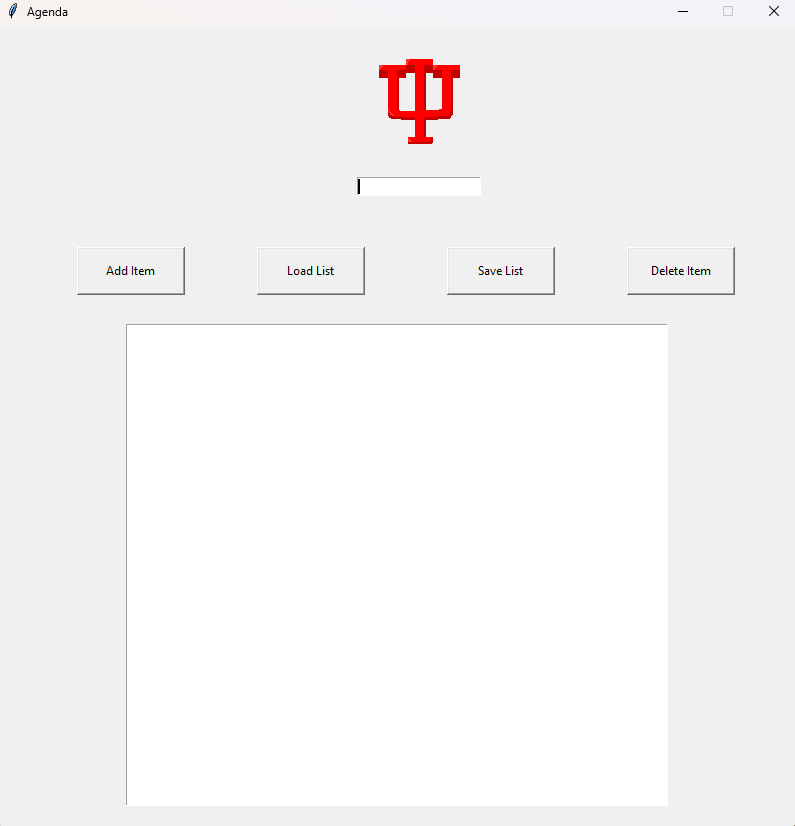

# Python-Agenda
<h1>Python Agenda</h1>

<h2>Description</h2>
A simple Python Agenda program that allows you to add and delete tasks or reminders and save lists to JSON files.
 

<h2>Languages and Utilities Used</h2>

- <b>Python</b> 
- <b>Pycharm</b>
- <b>tkinter</b>
- <b>pillow</b>
- <b>piskel</b>

<h2>Environments Used </h2>

- <b>Windows 11</b> 
